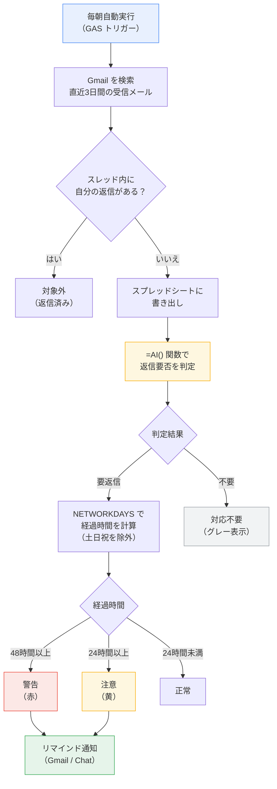
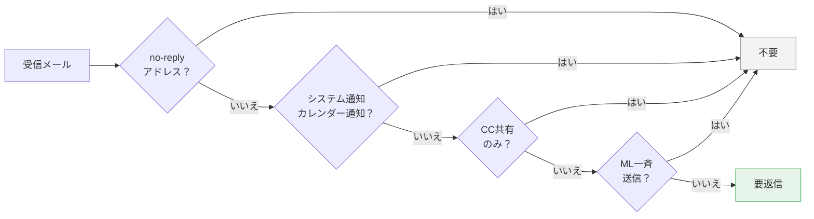
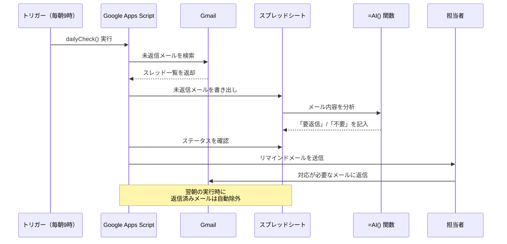

## 課題

日々届くメールの中には、返信が必要なものと不要なもの（通知、CC共有など）が混在している。件数が多い日は返信すべきメールを見落としたまま数日が過ぎてしまうことがある。特に金曜に届いたメールを月曜まで放置してしまうケースや、繁忙期に埋もれてしまうケースが発生しやすい。

## この記事が役立つケース

**導入が効果的な場合:**
- 1日の受信メールが多く、返信漏れが発生したことがある
- 週明けに「金曜のメールに返信し忘れていた」と気づくことがある
- メールの対応状況を自分で管理するのが難しいと感じている

**現状のままで十分な場合:**
- 受信メールが少なく、すべて把握できている
- メールクライアントのフォローアップ機能で十分に管理できている

## 解決策

**Google Apps Script（GAS）** で Gmail の受信メールのうち自分が返信していないものを抽出し、**Google スプレッドシート** に一覧化する。スプレッドシートの **Gemini 内蔵関数 `=AI()`** でメール内容から返信の要否を自動判定し、「要返信」と判定されたメールだけをリマインド対象とする。土日祝日を非勤務日として除外し、勤務時間ベースで 24 時間以内・48 時間以内の未返信メールを段階的に通知する。

API キーの取得や外部サービスの契約は不要。Google Workspace の標準機能の範囲内で完結する。

## なぜ GAS を使うのか

この仕組みでは Google Apps Script（GAS）を使用している。本サイトの他の記事では GAS を使わない方針を採っているが、この記事は例外として GAS を使用する。理由は以下のとおり。

- Gmail の受信済みメールを一括検索する機能は、Google Workspace Studio（Flows）に現時点で実装されていない（Flows のトリガーは「メール受信時」のみで、過去メールの検索はできない）
- GAS の `GmailApp.search()` でなければ、受信済みメールのスレッドを取得して返信有無を判定する処理が実現できない
- AI による返信要否の判定は GAS 内では行わず、スプレッドシートの `=AI()` 関数（Gemini）に任せることで、GAS の役割をメールの取得と書き出しに限定している

将来 Flows にメール検索アクションが追加された場合は、GAS を使わない構成に移行できる。

## 仕組みの全体像



## 前提条件

- Google Workspace Business Standard 以上（`=AI()` 関数の利用に必要）
- Google Apps Script の実行権限

## 構築手順

### 1. 管理用スプレッドシートの作成

Google スプレッドシートを新規作成し、以下のシートを用意する。

#### 「未返信メール」シート

| A: メールID | B: 差出人 | C: 件名 | D: 本文（冒頭200文字） | E: 受信日時 | F: 経過時間（勤務時間） | G: AI判定 | H: ステータス |
|------------|----------|---------|---------------------|-----------|---------------------|----------|-------------|
| （GASが記入） | （GASが記入） | （GASが記入） | （GASが記入） | （GASが記入） | （数式） | （=AI()） | （数式） |

#### 「設定」シート

運用パラメータを1か所で管理する。

| 設定項目 | 値 |
|---------|-----|
| 自分のメールアドレス | user@example.ac.jp |
| 検索対象の日数 | 3 |
| 注意の閾値（時間） | 24 |
| 警告の閾値（時間） | 48 |
| 祝日一覧の開始行 | 5 |

同じ「設定」シートの A5 以降に、年度の祝日を一覧で記入する。

| 日付 | 名称 |
|------|------|
| 2026-01-01 | 元日 |
| 2026-01-12 | 成人の日 |
| 2026-02-11 | 建国記念の日 |
| ... | ... |

### 2. 経過時間の計算（数式）

「未返信メール」シートの F 列に、土日祝を除いた勤務時間ベースの経過時間を計算する数式を設定する。

```
=NETWORKDAYS(E2, NOW(), 設定!A5:A30) * 24 - HOUR(E2) + HOUR(NOW())
```

この数式は以下を行う。
- `NETWORKDAYS` で土日を除いた営業日数を計算
- 第3引数で祝日リストを参照し、祝日も除外
- 時間単位の経過を概算で算出

厳密な時間計算が必要な場合は、GAS 側で勤務時間（9:00〜17:00）を考慮した計算に置き換えてもよい。

### 3. Gemini による返信要否の判定

G 列に `=AI()` 関数を設定し、メールの内容から返信が必要かどうかを判定する。

```
=AI("以下のメールは返信が必要ですか？「要返信」「不要」のどちらかだけで答えてください。通知メール、自動送信メール、CCで共有されただけのメール、メーリングリストの一斉送信は「不要」と判定してください。", B2&" / "&C2&" / "&D2)
```

**判定の考え方:**



### 4. ステータスの自動判定

H 列に数式を設定し、経過時間と AI 判定をもとにステータスを表示する。

```
=IF(G2="不要", "対応不要",
  IF(F2>=設定!B5, "警告",
    IF(F2>=設定!B4, "注意", "正常")))
```

条件付き書式で色分けする。
- 「警告」（48時間以上）→ 赤の背景色
- 「注意」（24時間以上）→ 黄の背景色
- 「対応不要」→ グレーの文字色

### 5. GAS スクリプトの作成

スプレッドシートの「拡張機能」→「Apps Script」を開き、以下のスクリプトを作成する。

#### 未返信メールの抽出

```javascript
function extractUnrepliedEmails() {
  const ss = SpreadsheetApp.getActiveSpreadsheet()
  const sheet = ss.getSheetByName('未返信メール')
  const settingsSheet = ss.getSheetByName('設定')

  const myEmail = settingsSheet.getRange('B1').getValue()
  const searchDays = settingsSheet.getRange('B2').getValue()

  // 既存データをクリア（ヘッダー行は残す）
  const lastRow = sheet.getLastRow()
  if (lastRow > 1) {
    sheet.getRange(2, 1, lastRow - 1, 8).clearContent()
  }

  // 直近N日間の受信メールを検索
  const query = 'in:inbox newer_than:' + searchDays + 'd -from:me'
  const threads = GmailApp.search(query, 0, 100)

  const results = []

  for (const thread of threads) {
    const messages = thread.getMessages()
    const lastMessage = messages[messages.length - 1]

    // 最後のメッセージが自分からの送信なら、返信済みと判断
    if (lastMessage.getFrom().indexOf(myEmail) !== -1) {
      continue
    }

    // スレッド内に自分の返信があるか確認
    const hasMyReply = messages.some(function(msg, index) {
      return index > 0 && msg.getFrom().indexOf(myEmail) !== -1
    })

    // 自分が最後のメッセージに返信していない場合のみ対象
    if (!hasMyReply || lastMessage.getFrom().indexOf(myEmail) === -1) {
      const from = lastMessage.getFrom()
      const subject = thread.getFirstMessageSubject()
      const body = lastMessage.getPlainBody().substring(0, 200)
      const date = lastMessage.getDate()
      const messageId = lastMessage.getId()

      results.push([messageId, from, subject, body, date])
    }
  }

  if (results.length > 0) {
    sheet.getRange(2, 1, results.length, 5).setValues(results)
  }
}
```

#### リマインド通知の送信

```javascript
function sendReminder() {
  const ss = SpreadsheetApp.getActiveSpreadsheet()
  const sheet = ss.getSheetByName('未返信メール')
  const settingsSheet = ss.getSheetByName('設定')
  const myEmail = settingsSheet.getRange('B1').getValue()

  const lastRow = sheet.getLastRow()
  if (lastRow < 2) return

  const data = sheet.getRange(2, 1, lastRow - 1, 8).getValues()

  const warnings = []
  const cautions = []

  for (const row of data) {
    const status = row[7] // H列: ステータス
    const from = row[1]   // B列: 差出人
    const subject = row[2] // C列: 件名
    const hours = row[5]  // F列: 経過時間

    if (status === '警告') {
      warnings.push('- ' + subject + '（' + from + '）… ' + Math.floor(hours) + '時間経過')
    } else if (status === '注意') {
      cautions.push('- ' + subject + '（' + from + '）… ' + Math.floor(hours) + '時間経過')
    }
  }

  if (warnings.length === 0 && cautions.length === 0) return

  let body = '未返信メールのリマインダーです。\n\n'

  if (warnings.length > 0) {
    body += '【警告: 48時間以上未返信】\n' + warnings.join('\n') + '\n\n'
  }

  if (cautions.length > 0) {
    body += '【注意: 24時間以上未返信】\n' + cautions.join('\n') + '\n\n'
  }

  body += 'スプレッドシート: ' + ss.getUrl()

  GmailApp.sendEmail(myEmail, '【リマインダー】未返信メールがあります', body)
}
```

#### メイン関数（抽出 → 判定待ち → 通知）

```javascript
function dailyCheck() {
  extractUnrepliedEmails()
  // =AI() 関数の計算完了を待つ（30秒）
  Utilities.sleep(30000)
  // スプレッドシートを再読み込みして最新の値を取得
  SpreadsheetApp.flush()
  sendReminder()
}
```

### 6. トリガーの設定

GAS のトリガーを設定して毎朝自動実行する。

**手順:**

1. Apps Script エディタの左メニューから「トリガー」をクリック
2. 「トリガーを追加」をクリック
3. 以下のように設定する

| 項目 | 設定値 |
|------|--------|
| 実行する関数 | dailyCheck |
| イベントのソース | 時間主導型 |
| 時間ベースのトリガーのタイプ | 日付ベースのタイマー |
| 時刻 | 午前 9 時〜10 時 |

4. 「保存」をクリック

### 7. 動作確認

1. 手動で `dailyCheck` を実行する
2. スプレッドシートの「未返信メール」シートにデータが書き込まれるか確認する
3. `=AI()` 関数の判定結果（G列）が表示されるか確認する
4. ステータス（H列）の色分けが正しいか確認する
5. リマインドメールが届くか確認する

**初回実行時の注意:** GAS が Gmail へのアクセス権限を求めるダイアログが表示される。内容を確認して許可する。

## 運用フロー



### 毎朝（自動）

1. GAS が Gmail から直近3日間の未返信メールを抽出
2. スプレッドシートに一覧を書き出し
3. `=AI()` が各メールの返信要否を判定
4. 「要返信」かつ 24 時間以上経過のメールがあれば、リマインドメールを送信

### 担当者の操作

1. リマインドメールを受け取ったら、スプレッドシートを確認する
2. 対応が必要なメールに返信する
3. 次回の実行時には、返信済みのメールは自動的にリストから消える

## 導入効果

| 項目 | 導入前 | 導入後 |
|------|--------|--------|
| 未返信メールの把握 | 受信トレイを自分で確認（見落としあり） | 毎朝自動で一覧化 |
| 返信が必要かの判断 | 1通ずつ自分で判断 | Gemini が自動判定 |
| 週末を挟んだ対応漏れ | 月曜に気づく（遅い） | 土日を除外した経過時間で正確に通知 |
| 対応の優先度判断 | 感覚的 | 経過時間で段階的に色分け表示 |

## 応用例

- **チーム共有**: 複数人の共有メールアドレス（学生課@...など）宛のメールを対象にし、チーム全員に通知する
- **対応履歴の蓄積**: スプレッドシートのデータを月次で集計し、対応件数や平均応答時間を分析する
- **Google Chat 通知**: リマインドをメールではなく Google Chat のスペースに送信する。`sendReminder` 関数内の `GmailApp.sendEmail` を Chat の Webhook 送信に置き換える

## 注意点

- `=AI()` 関数の判定は完璧ではない。重要なメールが「不要」と判定される可能性があるため、判定結果を過信せず、定期的にスプレッドシートの一覧を確認する習慣をつける
- `=AI()` 関数には1日あたりの実行回数上限がある。未返信メールが極端に多い場合（1日100件以上）は上限に達する可能性がある。通常の業務量であれば問題ない
- GAS のトリガーは非勤務日（土日祝）にも実行されるが、経過時間の計算が非勤務日を除外しているため、不要なリマインドは発生しにくい。気になる場合は `dailyCheck` の冒頭に曜日チェックを追加する
- メール本文をスプレッドシートに書き出すため、機密性の高いメールが含まれる場合はスプレッドシートの共有範囲に注意する。個人利用であれば問題ない
- 祝日一覧は年度初めに更新する。内閣府の「国民の祝日」一覧を参考に入力する
